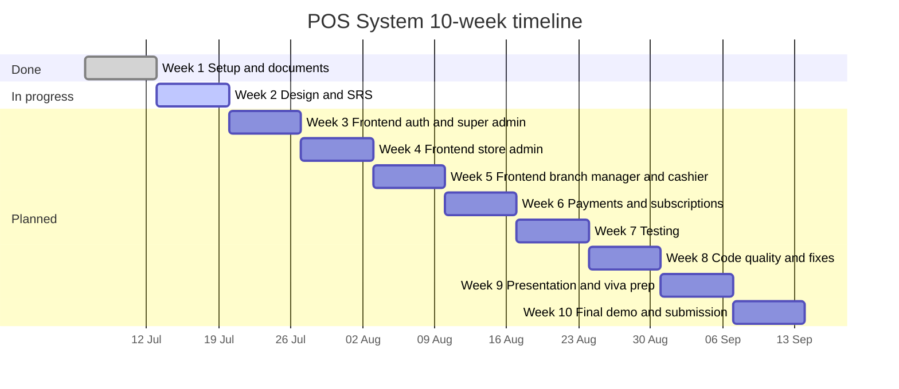

# Project Timeline: Multi-Tenant POS System

The project runs for 10 weeks, planned from Monday 6 July 2026. The Status column shows where the work stands today. Weeks 3 to 10 are a suggested plan and are updated as the work moves forward. The editable version, with week dates calculated from the start date, is in `Project_Timeline.xlsx` in this folder.

## Timeline chart

## Week by week

| Week | Dates | Phase | Tasks | Status |
| --- | --- | --- | --- | --- |
| 1 | 6 to 12 Jul | Setup and documents | Team repo and report folders, backend upload, idea and abstract, feature list, frontend config, Redux Toolkit part 1, Postman testing report, commit log | Done |
| 2 | 13 to 19 Jul | Design and SRS | Commit UML and ER diagrams, SRS in IEEE format, Redux part 2 and `globleState.js`, Branch Manager and Cashier pages | In progress |
| 3 | 20 to 26 Jul | Frontend: auth and super admin | Login, forgot and reset password, onboarding, landing page, super admin dashboard, stores, requests, subscription plans | Planned |
| 4 | 27 Jul to 2 Aug | Frontend: store admin | Branches, categories, products, employees, inventory, store dashboard, alerts | Planned |
| 5 | 3 to 9 Aug | Frontend: branch manager and cashier | Branch orders, refunds, inventory, reports, POS screen, returns, order history, customer lookup, shift summary | Planned |
| 6 | 10 to 16 Aug | Payments and subscriptions | Razorpay and Stripe checkout, subscription upgrade, payment status, email receipts | Planned |
| 7 | 17 to 23 Aug | Testing | Run the Postman collection with all role tokens, record results, negative and security tests, unit tests | Planned |
| 8 | 24 to 30 Aug | Code quality and fixes | Axios interceptor, logout fix, API URL in env file, remove console logs, fix security findings, update README | Planned |
| 9 | 31 Aug to 6 Sep | Presentation and viva prep | Report PPT, demo script, viva questions, final documents | Planned |
| 10 | 7 to 13 Sep | Final demo and submission | Full demo run, final checks, final commit log, submission | Planned |

## Completed so far

| Item | Evidence |
| --- | --- |
| Team repo and report folders | `80c721c`, `4584088` |
| Spring Boot backend uploaded | `ef6144e` |
| Idea, abstract and objectives | see `commit_log.csv` |
| Features, modules and tech stack | `13dc390` |
| Frontend folder structure | `ddf392b`, `751e82d` (subhash8729) |
| Frontend config, API client and utils | `dbcae3a` |
| Redux Toolkit part 1 (11 features) | `7ab1196` to `9809d35` |
| Commit log | `046f470`, `67e0b4c`, `8360f7e` |
| Postman testing report, 2 parts | `9e2ca1a`, `8172cb7` |
| UML, ER and architecture diagrams | `11645a2` |
| README with weekly plan | `b0ebffe`, `b4bee2d` |
| 10-week timeline and tracker | `75398a4`, `28069ac`, `65daf38` |
| Week 1 report and template | `4430a3c`, `7ce4830` |
| Branch Manager pages (customers, dashboard, cashier performance) | `3197520`, `bb95311`, `db9c60b` (choubisavishvas-web) |

Made but not committed yet: the API test case sheet (96 cases).
In progress: Cashier pages (iamvkb7), Onboarding page (tanyasingh077), Branch Manager pages (choubisavishvas-web), Redux Toolkit part 2 and `globleState.js`.

## Marks status

| Component | Marks | Status |
| --- | --- | --- |
| Idea & Abstract | 5 | Done |
| SRS / Documentation | 10 | Not started |
| Design (Use-case, Class, ER) | 10 | Done, diagrams committed |
| Weekly Progress | 25 | Ongoing, updated every week |
| Implementation & Code Quality | 20 | In progress |
| Testing | 10 | Report written, results to record |
| Presentation | 10 | Not started |
| Demo & Viva | 10 | Not started |
